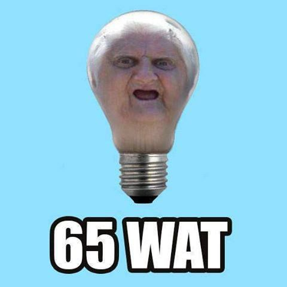
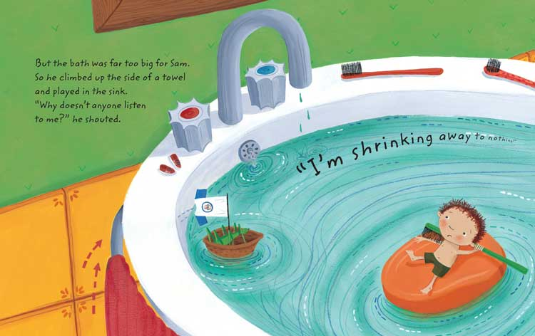

<!-- background: "./assets/san_francisco.svg" -->

Note:
Hi, my name is Sune, I'm a software engineer at Zendesk.<br> I'm
here to talk to you about property based testing with a
JavaScript assertion library called Unexpected that I'm the
author of.

===

## The birth of unexpected-check

Note:
Back in December I was speaking about testing with a coworker and he mentioned
that he was interested in property based testing and wanted to try it out in
practice.
I was interested so see if it was possible to support this kind of testing with
Unexpected.

Note:
I just had one problem and that is time. 

---


Note: Being a parent I still have time to think about things. So I basically
spend a month thinking about the problem.

Note: In January I was going on an onboarding trip with Zendesk for two weeks to San
Francisco. I knew I would have time to implemented a solution on this trip. 

---


<!-- background: "./assets/copenhagen_to_san_francisco.png" -->

Note:
Luckily the flight happened to be one of the old SAS flights that haven't been
renewed, it had a really crappy entertainment system. So I kept awake for the
entire trip hacking on unexpected-check and chance-generators - and I managed to
make a working first version on that flight.

---

http://unexpected.js.org/unexpected-check

===


## Property based testing

Note:
Property based testing is also known generative testing or randomized testing.
The idea was introduced by Koen Claessen and John Hughes with the Haskell
library QuickCheck in 1999. But even though the idea is really old, property
based testing has only found popularity among functional programming languages
communities, which is a pity.

#### -what is it all about?

---

Property based testings makes statements about a piece of code while being
exercised with data taken from a given input space.

Note:
That sounds really hairy and academic, but it is basically just about generating
random input of a given form, exercise your code with the input and assert a set
of properties about your program.

===

### Problems that are well suited for property based testing

===

### Functions that have an inverse function

---

* reverse
* encode/decode
* add/remove

Note: many mathematical function

---

Note: let see an example.

Imagine we wanted to test the encodeURIComponent function.

Note: encodeURIComponent encode a string to be inserted as part of a URI.

---

### Example-based testing

Note: how would we test this function with example based testing?

```js
expect(encodeURIComponent(''), 'to equal', '')
expect(encodeURIComponent('Hello ATF'), 'to equal', 'Hello%20ATF')
expect(encodeURIComponent('100% cool!'), 'to equal', '100%25%20cool!')
expect(encodeURIComponent('~&?'), 'to equal', '~%26%3F')
```

---

### Property-based testing

Note: Notice that the encodeURIComponent has the following property. If you
encode a string and decode it again you should get the same string back.

decodeURIComponent(encodeURIComponent(s)) = s

---

Note: The chance-generators library is a generator layer on top of the excellent
http://chancejs.com/ library that enables us to use all the chancejs functions
as generators.

Let's start out by generating some strings:

```js
var Generators = require('chance-generators')

var { natural, string } = new Generators(42)
var strings = string({ length: natural({ max: 50 })})
```

Note: We use a seeded random as it is important that test are reproducible.

---

```js
expect.use(require('unexpected-check'))

expect((string) => {
  expect(
    decodeURIComponent(encodeURIComponent(string)),
    'to equal',
    string
  )
}, 'to be valid for all', strings)
```

Note: it is tempting to just rely property based testing, but I would always
complement it with sanity checks.

===

### Functions where it is easier to check the result than computing it

---

* sorting
* searching
* most transformations

Note:
sorting - each items is less than or equal to the next item
searching - sorting for each item should yield the index of the item

Note: a huge amount of problems has this characteristics

---


## Testing a sorting function

isSorted(sort(a)) = true

---

```js
function isSortedAscending (array) {
  return array.every((x, i) => {
    return array.slice(i).every((y) => x <= y)
  })
}
```

---

Let's make an assertion for checking<br>
that arrays are sorted ascending:

```js
expect.addAssertion('to be sorted ascending', (expect, subject) => {
  expect(isSortedAscending(subject), 'to be true')
})
```

---

Quicksort sorts arrays of strings correctly

```js
var quicksort = require('quicksort.js');

var { array, string } = new Generators(42)
var stringArrays = array(string)

expect((array) => {
  expect(quicksort.asc(array), 'to be sorted ascending')
}, 'to be valid for all', stringArrays)
```

Note: notice how we are testing both the isSortedAscending function and the
sorting function, property based testing will find bugs in your production code
as wells as in your testing code.

---

...and integer arrays:

```js
var { array, integer } = new Generators(42)

var integerArrays = array(
  integer({ min: -100, max: 100 })
)

expect((array) => {
  expect(quicksort.asc(array), 'to be sorted ascending')
}, 'to be valid for all', integerArrays)
```

---

Let's try the same with the build-in sorting function:

```js
expect((array) => {
  expect(array.sort(), 'to be sorted ascending')
}, 'to be valid for all', integerArrays)
```

---

And it fails!



Note: Wat we can't even sort integers anymore, what is even happening?

---

We get the following error:

```output
Ran 65 iterations and found 20 errors
counterexample:

  Generated input: [ -45, -95 ]

  expected [ -45, -95 ] to be sorted ascending
```

Note: The explanation: build-in search sort alphabetically based on string
conversion.

===

### Objects that maintains an invariant

---

* sets
* queues
* balanced search trees

Note:
sets - no duplicates
queues - items are retrieved in the same order they are inserted
balanced search trees - stays balanced

---

## Testing a queue


While adding and removing items, the items should always be retrieved in the
same order they where inserted.

Note: the way we are going to test the queue is to simulate operations on the
queue and check that it maintains this property.

---

Let's generate some operations:

```js
var { array, integer, pickone, shape } = new Generators(42)

var addOperation = shape({
  type: 'add',
  value: integer
})

var removeOperation = shape({
  type: 'remove'
})

var operations = array(
  pickone([addOperation, removeOperation])
)
```

---

This will generate arrays with the following structure:

```js#evaluate:false
[
  { type: 'remove' },
  { type: 'remove' },
  { type: 'add', value: -1331529414344704 },
  { type: 'remove' },
  { type: 'remove' },
  { type: 'remove' },
  { type: 'add', value: -4654237011148800 },
  { type: 'remove' },
  { type: 'add', value: 3344884333281280 },
  { type: 'remove' },
  { type: 'add', value: 1939033726910464 }
]
```

---

```js
function execute(queue, operations) {
  const added = [], removed = []
  operations.forEach(({ type, value }) => {
    if (type === 'add' && !queue.isFull()) {
      queue.offer(value)
      added.push(value)
    } else if (type === 'remove' && !queue.isEmpty()) {
      removed.push(queue.poll())
    }
  })

  return { added, removed }
}
```

---

```js
var CircularQueue = require('circular-queue');
var capacities = natural({ min: 1, max: 50 })

expect((capacity, operations) => {
  const queue = new CircularQueue(capacity);
  const { added, removed } = execute(queue, operations)
  expect(
    removed,
    'to equal',
    added.slice(0, added.length - queue.size)
  )
}, 'to be valid for all', capacities, operations)
```

---

Reuse generated operations:

```js
expect(function (capacity, operations) {
  const queue = new CircularQueue(capacity);
  operations.forEach(({ type, value }) => {
    const currentSize = queue.size
    if (type === 'add' && !queue.isFull()) {
      queue.offer(value)
      expect(queue.size, 'to equal', currentSize + 1)
    } else if (type === 'remove' && !queue.isEmpty()) {
      queue.poll()
      expect(queue.size, 'to equal', currentSize - 1)
    }
  })
}, 'to be valid for all', capacities, operations)
```

===

## Input shrinking



Note: the inputs generated by chance-generators will usually be huge and
unmanageable. Shrinking is the process of generating a smaller failing example.

---

```js
var arrayEqual = require('array-equal')

function containsSubArray(array, subArray) {
  return array.some((v, i) => (
    arrayEqual(array.slice(i, i + subArray.length), subArray)
  ))
}
```

Note: can anybody spot the error?

---

```js
var { array, integer, natural } = new Generators(314)
var lengths = natural({ max: 100 })
var arrays = array(integer, lengths)
var offsets = natural({ max: 100 })

expect((array, offset, length) => {
  const subArray = array.slice(offset, offset + length)
  expect(
    containsSubArray, 'when called with', [array, subArray],
    'to be true'
  )
}, 'to be valid for all', arrays, offsets, lengths)
```

---

```output
Ran 14 iterations and found 14 errors
counterexample:
 
  
Generated input: [], 0, 0
with: n(integer, natural({ max: 100 })), natural({ max: 100 }), natural({ max: 100 })
 
expected
function containsSubArray(array, subArray) {
  return array.some((v, i) => (
    arrayEqual(array.slice(i, i + subArray.length), subArray)
  ))
}
when called with [], [] to be true
  
expected false to be true
```

---

The assertion finds an error in the first iteration and shrinks it to the
optimal output in 14 iterations. Here are the last iterations:

```js#evaluate:false
...
input([], 3, 3) => containsSubArray([], [].slice(3, 3 + 3)) === true
input([], 2, 3) => containsSubArray([], [].slice(2, 2 + 3)) === true
input([], 1, 1) => containsSubArray([], [].slice(1, 1 + 1)) === true
input([], 1, 1) => containsSubArray([], [].slice(1, 1 + 1)) === true
input([], 1, 1) => containsSubArray([], [].slice(1, 1 + 1)) === true
input([], 1, 0) => containsSubArray([], [].slice(1, 1 + 0)) === true
input([], 1, 0) => containsSubArray([], [].slice(1, 1 + 0)) === true
input([], 1, 0) => containsSubArray([], [].slice(1, 1 + 0)) === true
input([], 0, 0) => containsSubArray([], [].slice(0, 0 + 0)) === true
```

---

Shrinking a number:

```js
var { integer } = new Generators(42)
var numbers = integer({ min: -100, max: 100 })

var shrunkenGenerator = numbers.shrink(22)
// will return: integer({ min: 0,  max: 22 }) 
expect(shrunkenGenerator(), 'to be within', 0, 22)

var shrunkenGenerator = numbers.shrink(-33) 
// will return: integer({ min: -33, max: 0 }) 
expect(shrunkenGenerator(), 'to be within', -33, 0)
```

The shrunken values will converge towards zero.

---

Shrinking an array: 

```js
var { array, natural } = new Generators(42)
var arrays = array(natural({ max: 100 }), natural({ min: 2, max: 100 }))

var shrunkenGenerator = arrays.shrink([79, 25, 42, 94, 27])
// will return: pickset([79, 25, 42, 94, 27], natural({ min: 2, max: 5 }) 

expect(shrunkenGenerator(), 'to equal', [ 94, 27, 79 ])
expect(shrunkenGenerator(), 'to equal', [ 42, 79, 94, 25 ])
expect(shrunkenGenerator(), 'to equal', [ 42, 27 ])
```

The shrunken arrays will converge towards the smallest possible array.

===

<p style="color: white; position: fixed; top: 20px; left: 0px; width: 100%;">What will the future bring?</p>

<!-- background: "./assets/crystal-ball.jpg" -->

---

## Improved shrinking
### Shrinking nested generators

---

The sorting failure we saw earlier: `[-45,-95]`<br>
should have been: `[10,2]`.

*Done*

---

## More generators

Note: unexpected-check can use any kind of function that returns a value as a
generator. If it has a shrink method on the function, it will use that for
shrinking.

---

* json-schema-faker
* immutable-js generators
* Generator for React prop types

---

## Support asynchronous assertions

---

Useful for testing for race conditions with random executions plans.

Note: Testing the action executor.

*Done*

===

## Questions

===

## Real world example
#### Testing menu positioning

Note: maybe a drawing

===

## The end
